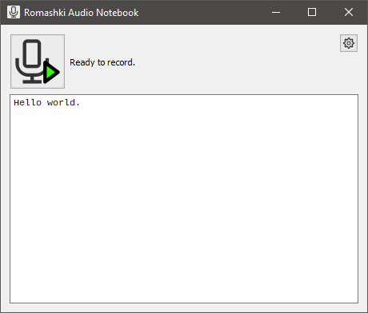

Romashki Audio Notebook
===

Simple speech-to-text application powered by [OpenAI Whisper](https://github.com/openai/whisper/tree/main/whisper).

You need to download audio recognition [model data file](https://github.com/openai/whisper/blob/main/whisper/__init__.py#L17-L30), for example, `small`. Note: do not use `*.en` data files in order to support multiple languages. When Romashki Audio Notebook is launched, you need to specify the path to the model file in the application settings.
